# Recruiter Dashboard — Architecture & Information Flow

This document explains how information flows through the **Recruiter Dashboard** feature of
`sh3r4rd.com`. The feature has two independent data paths that meet at a single DynamoDB table:

1. **Write path (ingestion):** Recruiter emails arrive via SES, are parsed/enriched by a Go
   Lambda using OpenAI, and persisted to DynamoDB.
2. **Read path (dashboard):** The React dashboard reads anonymized, aggregated data back out
   through API Gateway and a second Go Lambda.

A separate **resume-request** form path is shown for context (it shares the `api.sh3r4rd.com`
domain family but is a distinct backend endpoint).

---

## End-to-end diagram

```mermaid
flowchart TB
    %% ============ ACTORS ============
    recruiter([" Recruiter<br/>(sends email)"]):::actor
    visitor([" Site Visitor /<br/>Dashboard Viewer"]):::actor

    %% ============ FRONTEND ============
    subgraph FE["Frontend — React 19 + Vite (S3 + CloudFront)"]
        direction TB
        spa["sh3r4rd.com SPA<br/>react-router-dom v7"]:::fe
        dash["DashboardPage.jsx<br/>/dashboard route<br/>StatsCards · RecruiterTable · FilterBar"]:::fe
        resumeForm["ResumeRequestPage.jsx<br/>/resume route<br/>firstName…description + honeypot"]:::fe
        ga["PageTracker → Google Analytics<br/>G-L2852SHBRS"]:::ext
        spa --> dash
        spa --> resumeForm
        spa -.page_view.-> ga
    end

    %% ============ WRITE PATH: INGESTION ============
    subgraph WRITE["WRITE PATH — Email Ingestion (event-driven)"]
        direction TB
        ses["Amazon SES<br/>domain identity + DKIM<br/>MX → inbound-smtp.us-east-1"]:::aws
        rule["SES Receipt Rule 'store-and-parse-recruiter-email'<br/>recipient: recruiters@inbox.sh3r4rd.com (configurable)"]:::aws

        subgraph s3email["S3 — email_storage bucket"]
            raw["incoming/{messageId}<br/>raw RFC-2822 email<br/>AES-256 · 30-day lifecycle"]:::store
        end

        parser["Lambda: email-parser Go/arm64<br/>provided.al2023 · 30s · concurrency 2"]:::lambda
        openai["OpenAI API<br/>gpt-5-nano · structured JSON<br/>3 retries + backoff"]:::ext
        ssm["SSM Parameter Store<br/>/recruiter-dashboard/openai-api-key<br/>SecureString · cached"]:::aws
    end

    %% ============ SHARED DATA STORE ============
    subgraph DB["DynamoDB — recruiter-emails (PROVISIONED 15/15)"]
        direction TB
        table["PK id · SK received_at<br/>fields: company, job_title, recruiter_email,<br/>phone, confidence, date_year, date_day, dedup_key…"]:::store
        gsi1["GSI date-index<br/>date_year HASH · date_day RANGE"]:::store
        gsi2["GSI recruiter-index<br/>recruiter_email HASH · received_at RANGE"]:::store
        cache["STATS#cache sentinel item<br/>5-min TTL aggregates"]:::store
    end

    %% ============ READ PATH: DASHBOARD API ============
    subgraph READ["READ PATH — Dashboard API (request/response)"]
        direction TB
        r53["Route 53<br/>dashboard-api.sh3r4rd.com (A-alias)"]:::aws
        apigw["API Gateway REST · Regional · prod<br/>ACM TLS 1.2 · throttle 5 rps/10 burst<br/>GET /recruiters · /recruiters/{id} · /stats<br/>OPTIONS → MOCK for CORS"]:::aws
        apih["Lambda: api-handler Go/arm64<br/>10s · concurrency 5<br/>routes → DynamoDB → anonymizer"]:::lambda
        anon["anonymizer.go<br/>strips recruiter_email, first/last_name,<br/>phone, s3_key, s3_bucket, dedup_key;<br/>derives month from date_day; drops received_at"]:::logic
    end

    %% ============ RESUME REQUEST (separate API) ============
    resumeApi["api.sh3r4rd.com/requests<br/>separate resume-request backend"]:::aws

    %% ============ MONITORING ============
    subgraph MON["Observability"]
        direction TB
        logs["CloudWatch Logs<br/>7-day retention · both Lambdas"]:::aws
        alarms["CloudWatch Alarms<br/>parser errors · loop-detection ·<br/>parse-failures · api errors"]:::aws
        sns["SNS topic → email alert"]:::aws
        alarms --> sns
    end

    %% ---------- WRITE FLOW EDGES ----------
    recruiter -- "inbound email (SMTP)" --> ses
    ses --> rule
    rule -- "Action 1: PutObject" --> raw
    rule -- "Action 2: async invoke (Event)" --> parser
    parser -- "1. validate SPF/DKIM/spam/virus verdicts" --> parser
    parser -- "2. GetObject (≤10MB)" --> raw
    parser -- "3. GetParameter (decrypt, cached)" --> ssm
    parser -- "4. Extract recruiter fields" --> openai
    openai -- "JSON: name/company/title/phone/confidence" --> parser
    parser -- "5. sanitize → build record →<br/>PutItem (conditional, idempotent)" --> table
    parser -- "6. PutObjectTagging<br/>parse-status/company/confidence" --> raw

    %% ---------- READ FLOW EDGES ----------
    visitor --> spa
    dash -- "GET /recruiters (no params)<br/>GET /stats — filtering is client-side" --> r53
    r53 --> apigw
    apigw -- "AWS_PROXY" --> apih
    apih -- "?month= → date-index (unused by UI)" --> gsi1
    apih -- "full Scan (list) /<br/>?company= Scan / Query id (detail)" --> table
    apih -- "GetItem cache /<br/>PutItem (best-effort, denied by read-only IAM)" --> cache
    apih --> anon
    anon -- "anonymized JSON + CORS headers" --> dash

    %% ---------- RESUME FLOW ----------
    resumeForm -- "POST JSON" --> resumeApi

    %% ---------- MONITORING EDGES ----------
    parser -.logs/metrics.-> logs
    apih -.logs/metrics.-> logs
    logs -.thresholds.-> alarms

    %% ============ STYLES ============
    classDef actor fill:#1f2937,stroke:#9ca3af,color:#fff;
    classDef fe fill:#0ea5e9,stroke:#0369a1,color:#fff;
    classDef aws fill:#ff9900,stroke:#b36b00,color:#1a1a1a;
    classDef lambda fill:#f58536,stroke:#a8521c,color:#1a1a1a;
    classDef store fill:#3b48cc,stroke:#1e2a8a,color:#fff;
    classDef ext fill:#10b981,stroke:#047857,color:#fff;
    classDef logic fill:#8b5cf6,stroke:#5b21b6,color:#fff;
```

---

## Write path — step by step (email-parser Lambda)

Trigger: **SES `SimpleEmailEvent`** (asynchronous `Event` invocation from the receipt rule).

| # | Operation | Component / Service | Notes |
|---|-----------|---------------------|-------|
| 0 | Email arrives | SES receipt rule `store-and-parse-recruiter-email` | Two ordered actions: S3 store, then Lambda invoke |
| 1 | Validate verdicts | `handler.validateVerdicts` | Rejects on SPF/DKIM/Spam/Virus = FAIL |
| 2 | Fetch raw email | S3 `GetObject` (`incoming/{messageId}`) | 10 MB cap |
| 3 | Fetch OpenAI key | SSM `GetParameter` (SecureString) | Lazy, in-memory cached across warm invocations |
| 4 | Parse MIME | `internal/parser` | Handles multipart, base64/quoted-printable, forwarded-email detection (Gmail/Outlook/Apple) |
| 5 | Extract fields | `internal/extractor` → OpenAI `gpt-5-nano` | Strict JSON schema; 3 retries w/ exponential backoff; falls back to `UnknownResult()` |
| 6 | Sanitize | `internal/sanitizer` | Phone → E.164, name cleaning |
| 7 | Persist | DynamoDB `PutItem` | Conditional `attribute_not_exists(id) AND attribute_not_exists(received_at)` → idempotent / dedup |
| 8 | Tag object | S3 `PutObjectTagging` | `parse-status` = success/partial/failed (+ company, sender, confidence, parsed-at) |

**Record shape written:** `id`, `received_at`, `first_name`, `last_name`, `recruiter_email`,
`company`, `job_title`, `phone`, `subject`, `confidence`, `s3_bucket`, `s3_key`, `dedup_key`,
`date_year`, `date_day`.

## Read path — step by step (api-handler Lambda)

Trigger: **API Gateway `AWS_PROXY`** (synchronous).

| Route | DynamoDB access | Notes |
|-------|-----------------|-------|
| `GET /recruiters` | `?month=` → Query **date-index** GSI; `?company=` → Scan + `contains(company)`; neither → full Scan | All exclude `STATS#cache`; sorted by `received_at` desc. **The dashboard UI calls this with no params and filters client-side**, so only the full-Scan branch is exercised in practice |
| `GET /recruiters/{id}` | Query main table by `id` PK, `Limit 1`, desc | 404 on `STATS#cache` |
| `GET /stats` | `GetItem` cache → on miss/expiry, projected Scan + aggregate, then `PutItem` to refresh the cache | Writes a 5-min TTL cache item (`STATS#cache` / `CACHE`); subsequent requests serve from cache until expiry. The `PutItem` is non-fatal — a write failure just means the next request re-scans |

Every response passes through **`anonymizer.go`**, which strips PII (`recruiter_email`,
`first_name`, `last_name`, `phone`, `s3_key`, `s3_bucket`, `dedup_key`), derives a public
`month` (`YYYY-MM`) from the `date_day` attribute, and drops `received_at` entirely. All
responses carry CORS headers
(`Access-Control-Allow-Origin` = `CORS_ALLOW_ORIGIN`).

## Key boundaries & guarantees

- **Two distinct domains:** dashboard data is read from `dashboard-api.sh3r4rd.com`; the resume
  form posts to `api.sh3r4rd.com/requests` (separate backend).
- **PII never leaves the backend:** raw recruiter identity is stored in DynamoDB but the
  anonymization layer guarantees the dashboard only ever sees company/title/month/confidence.
- **Idempotency:** SES redelivery is safe because of the conditional DynamoDB write
  (`attribute_not_exists(id) AND attribute_not_exists(received_at)`). A SHA-256 `dedup_key` is
  also stored for future cross-message dedup, but is not yet part of the idempotency guarantee.
- **Least privilege:** email-parser role can read/tag S3 + write DynamoDB + read one SSM param;
  api-handler role is DynamoDB read (`GetItem`/`Query`/`Scan` on table + both GSIs) plus a
  single narrowly-scoped `PutItem` — constrained by a `dynamodb:LeadingKeys` condition to the
  partition key `STATS#cache`, so it can only write the `/stats` cache item and no other
  DynamoDB write actions are granted. (The cache item does not appear in either GSI because it
  lacks the GSI key attributes, not because of resource scoping — `PutItem` is always evaluated
  against the table and indexes update automatically.)

---
*Generated from source review of `infra/recruiter-dashboard/` (Terraform + Go Lambdas) and `src/` (React).*
